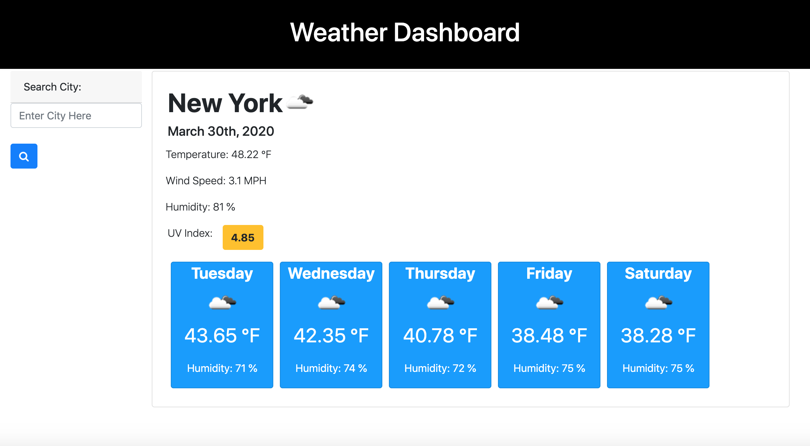

#  **Weather Forecast** # 
[GitHub](https://github.com/charrmountain/weather-forecast)

[Deployed Link](https://charrmountain.github.io/weather-forecast/)

## Table of Contents

- [Description](#description) 

- [Visual](#visual) 

- [Usage](#usage) 

- [Contributing](#contributing) 

- [Tests](#tests) 

- [Support](#support) 

## **Description**

-  User can view the weather forecast for any of their favorite cities. Once user searches for the city they desire they are presented with a full page of the current forecast. Which includes the current temperature, humidity, wind speed, and UV index. At the bottom of this same page the user can also view a full 5 day forecast of the selected city which displays the temperature and humidity for each day. Lastly, if the user exits or reloads the page their last search persists.

    - ### **HTML pages:**

         - [index.html](index.html) is the main home page for the quiz
         - [script.js](script.js) is the JavaScript for script to make page run correctly.

    - ### **Style Sheets** (used on all HTML pages)**:**

         - [style.css](style.css) (created by Coding)
         - [Bootstrap] (https://getbootstrap.com/Bootstrap)

## **Visuals**

- Icons that display for the current and future weather types 
- Past searches saved on side bar

## **Usage**

- Be able to see multiple weather aspects for any city in the world!

## **Support**
    

- e-mail: charr.mt@gmail.com
